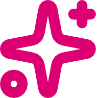
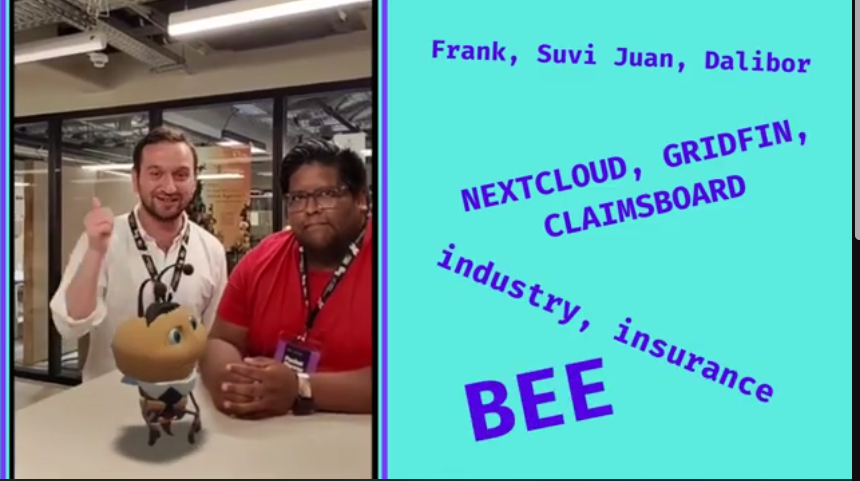
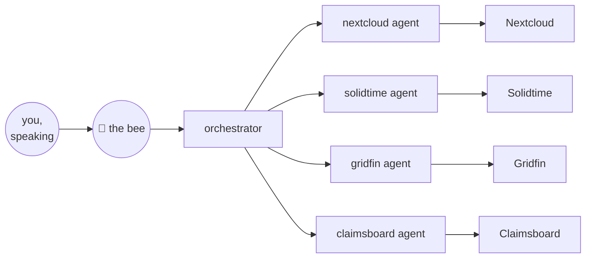

<div align="center">

</div>

<h3 align="center">Looka</h3>
<p align="center">
    Agents in space, with a form, a place and a personality
    <br />
    <em>4 members · 3 applications · 2 use cases · 1 bee</em>
    <br />
    <a href="https://www.youtube.com/watch?v=U_kG90wro5E">Youtube</a>
    ·
    <a href="https://lookalabs.com">Live</a>
    ·
    <a href="https://github.com/mielikuvitus/looka">Code</a>
</p>

### Video

<a href="https://www.youtube.com/watch?v=U_kG90wro5E">
  
</a>

## Idea

Humans communicate mostly nonverbally, yet we talk to agents through a wall of
text. Looka gives the agent a form, a place and a personality: a small bee
that lives in your room, flies over when you talk to it, and gets real work
done in the software your team already uses. Iron Man had FRIDAY. We have a
bee.

## XRCC

This is our entry for the XR Creators Challenge '26 in Berlin, built in 36
hours. We submitted it twice:

- PICO Tech Layer track × Insurance: the bee at the claims desk (Claimsboard)
- PICO Tech Layer track × Industry: the bee in the warehouse (Gridfin)

We designed for the PICO headset first and adapted the fallbacks afterwards,
so the same app meets you on whatever you're holding:

| You have | You get |
| --- | --- |
| PICO / spatial headset | The full WebSpatial room, panels floating in space |
| VR headset in a browser | WebXR immersive session |
| A phone | Place the bee in your room in AR |
| Just a browser | The flat web experience (everything still works) |

## How

Talk to the bee. It listens, answers with a voice, and delegates the actual
work to a hive of specialist agents behind it.



An agent is a simple thing: LLM + harness + skills (or MCP, or whatever fits).
Give it a name and some skills and it works. Most agents need surprisingly
little, often just bash and a bit of guidance on how the software works.

- The Solidtime agent is the minimal case: one skill wrapping the Solidtime CLI.
- The Nextcloud agent is the complex one: a mail skill, CalDAV for the
  calendar, CardDAV for contacts, and WebDAV for files, sheets and slides.

The software the bee works, all live:

| Product | Purpose | Source | Live |
| --- | --- | --- | --- |
| Nextcloud | Files, mail, calendar and contacts | [github.com/nextcloud](https://github.com/nextcloud) | [nextcloud.leistenmacher.de](https://nextcloud.leistenmacher.de) |
| Solidtime | Time tracking | [github.com/solidtime-io](https://github.com/solidtime-io) | [solidtime.leistenmacher.de](https://solidtime.leistenmacher.de) |
| Gridfin | Warehouse management, the industry desk | private, built by frank | [gridfin.app](https://gridfin.app) |
| Claimsboard | Insurance claims, the insurance desk | [`claimsboard/`](./claimsboard/), built by us | [claimsboard.lookalabs.com](https://claimsboard.lookalabs.com) |

About that last row: there was no open-source claims tool worth wrapping, so
we built one ourselves, API-first, in the same 36 hours. Kanban board, claim
files, dashboard. Because the API was designed with the agent in mind, the
skill came almost for free. See [`claimsboard/`](./claimsboard/).

Two use cases, one pattern. Insurance back office (Claimsboard) and industrial
warehouse work (Gridfin): same bee, same skills mechanism, swap the desk. That
pattern is the product.

## Quickstart

```bash
pnpm install
cp .env.example .env   # fill in your keys
pnpm dev               # frontend + backend on one origin
```

```
looka/
├── frontend/     the room (React + TypeScript + Vite + WebSpatial)
├── backend/      the orchestrator (TypeScript API + SQLite via Drizzle)
├── claimsboard/  the claims app (Nuxt 4 + Nuxt UI + Better Auth)
└── misc/         pitch video, bee model, references, vision doc
```

Claimsboard runs on its own: see [`claimsboard/README.md`](./claimsboard/README.md).
For the PICO emulator setup, see [`misc/reference/xrcc/`](./misc/reference/xrcc/).

| Command | What it does |
| --- | --- |
| `pnpm dev` | Run frontend + backend together |
| `pnpm build` | Build every package |
| `pnpm lint` | `eslint . --fix` (antfu config, no Prettier) |
| `pnpm db:generate` / `db:migrate` / `seed` | Database plumbing |
| `pnpm gen:types` | Regenerate shared frontend API types |

Working in the repo? [`AGENTS.md`](./AGENTS.md) is the canonical guide.

## Tech stack

- [WebSpatial](https://webspatial.dev), HTML that lifts off the page: the spatial room
- WebXR: the raw immersive session the bee flies in
- React + Vite + TypeScript: the frontend
- Nuxt 4 + SQLite (Drizzle) + Better Auth: Claimsboard
- OpenClaw agents on frank's self-hosted openclaw infra (AI infrastructure with 20+ connectors, built by client demands): the hive

## Why

Dual approach. Software can be used through its UI or through an agent, and
both have to work. The UI gives you precision and overview, the agent gives
you speed and delegation. Each side covers the other's downside. Complementary,
not rivals.

## Future

Two directions from here:

1. Deepen the bee: let it show and open documents in the room instead of only
   speaking. A whole new problem set, and a tempting one.
2. Widen the hive: more connectors to more of the software people already run.
   The pattern proved itself twice; it will hold for a third.

## Team & thanks

Four of us built this in 36 hours:

| Name | Role | Contact |
| --- | --- | --- |
| Suvi Helin | Frontend Developer | suvi@pixelation.io |
| Dalibor Vuchikj | 3D Artist | dalibor.vuchikj@outlook.com |
| Juan Antonio Fonseca Méndez | Unity Developer | fonseca.juan8@gmail.com |
| Frank Dierolf | Full Stack Developer | frank_dierolf@web.de |

Thanks to the XRCC organizers for the space, the headsets and a great
weekend in Berlin.

---

<div align="center">

*4 members · 3 applications · 2 use cases · 1 bee*

</div>
